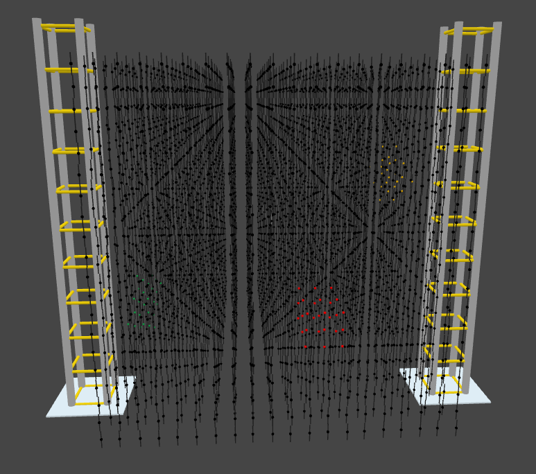
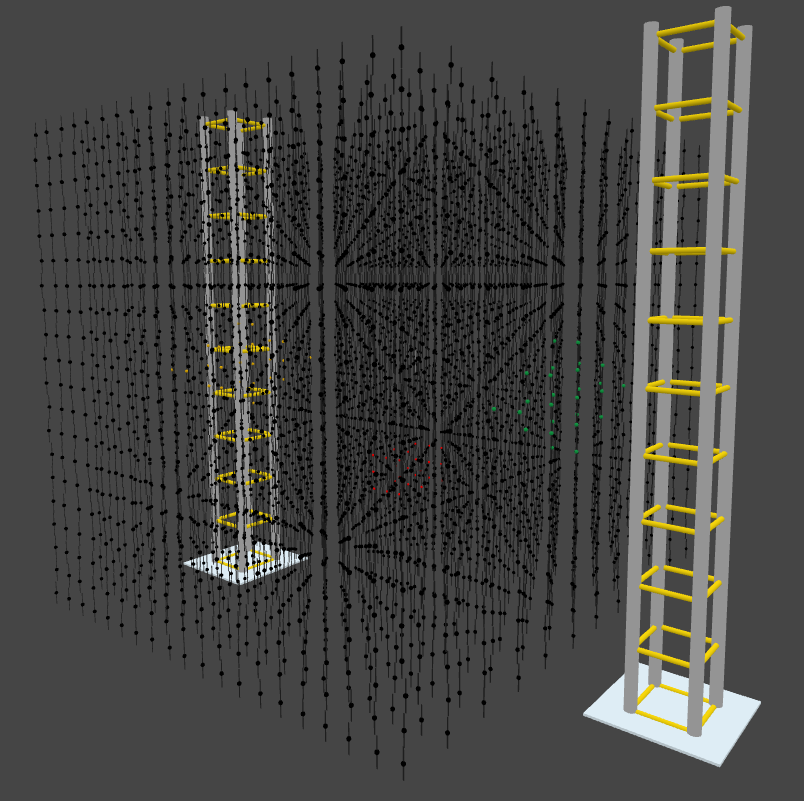

# Voxelbox 3D Pong

The Voxelbox is a 20³ led cube. Each vertex has a length of 2 Meters!
It can be found on [codeberg](https://codeberg.org/VoxelBox/voxelbox).

Here are two screenshots from the voxelbox simulator:




---

## Local Development

- Use a real voxelbox or use the [simulator](https://codeberg.org/VoxelBox/voxelbox).
- Connect a gamepad, I use a Dualshock 4 but all should work fine

### NixOS

There is a flake available so it should be enough to simply run this command:

```sh
nix develop
```

## Thanks <3

- Thanks derMicha for the Voxelbox workshop on the 38c3
- Thanks CMS for providing the Voxelbox on the 38c3
- I had a small conversation with a random person - they thought of this idea and we discussed it

